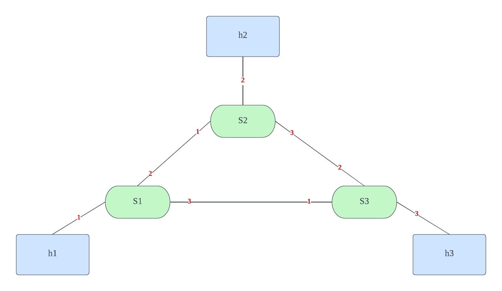

# Firewall Introduction
The goal of this project is to design and implement a firewall on the switch level to block malicious packet transmission to the target host ip address.


## Topology Graph


A design for the test scenior is that: suppose `h2` (10.0.2.2) is a malicious ip destination as opposed to our iot equiment source address `h1` (10.0.0.1), everyelse is connected initially. The functionality of the firewall works when `h1` detects a packet sending to `h2`, the consequent packets sending to `h2` are supposed to be blocked at `s1`.


## Implementation
A few dynamic changes make p4 hard to change the table rules by its native rules. Therefore, we use the p4 runtime as the middleware to 1).delete exist table. 2). change the table rule to drop the packet.

### Delete Table
The implementation for deleting the table is achieved by adding another function in `utils/p4runtime_lib`, the basic understanding is to tune to proto buffer type to `DELETE` and rewrite the request in the p4 runtime bmv2 model.

```
    def DeleteTableEntry(self, table_entry, dry_run=False):
        request = p4runtime_pb2.WriteRequest()
        request.device_id = self.device_id
        request.election_id.low = 1
        update = request.updates.add()
        # Assign DELETE Type for it
        update.type = p4runtime_pb2.Update.DELETE
        update.entity.table_entry.CopyFrom(table_entry)
        if dry_run:
            print("P4Runtime Delete: ", request)
        else:
            self.client_stub.Write(request)
```

### Drop Table
Based on `basic.p4` MyIngress table rule, the table rule for `ipv4_lpm` is as following:

```
    table ipv4_lpm {
        key = {
            hdr.ipv4.dstAddr: lpm;
        }
        actions = {
            ipv4_forward;
            drop;
            NoAction;
        }
        size = 1024;
        default_action = drop();
    }
```

The corresponding build drop entry in the controller is implemented as:

```
    table_entry = p4info_helper.buildTableEntry(
        table_name="MyIngress.ipv4_lpm",
        match_fields={
            "hdr.ipv4.dstAddr": (dst_ip_addr, 32)
        },
        action_name="MyIngress.drop"
    )
    ingress_sw.WriteTableEntry(table_entry)
```


## Test Instruction (developing)
0. make sure you are in the p4 virtual machine build by [vagrant](https://github.com/p4lang/tutorials)@p4 account.
1. run `make` to install the table in topo for switches.
2. use command `h1 ping h2` in the `mininet` to set up the connection between h1,h2 switches as the example, this should also work for any switches between h1 to h3.
3. run `sudo python3 controller.py` to simulate malicious request sent from h1 to h2, you should see there's no counter update for tunnel id 100 flashing in the mininet anymore. while if you `h1 ping h3`, the tunnel 200 should be updated.
